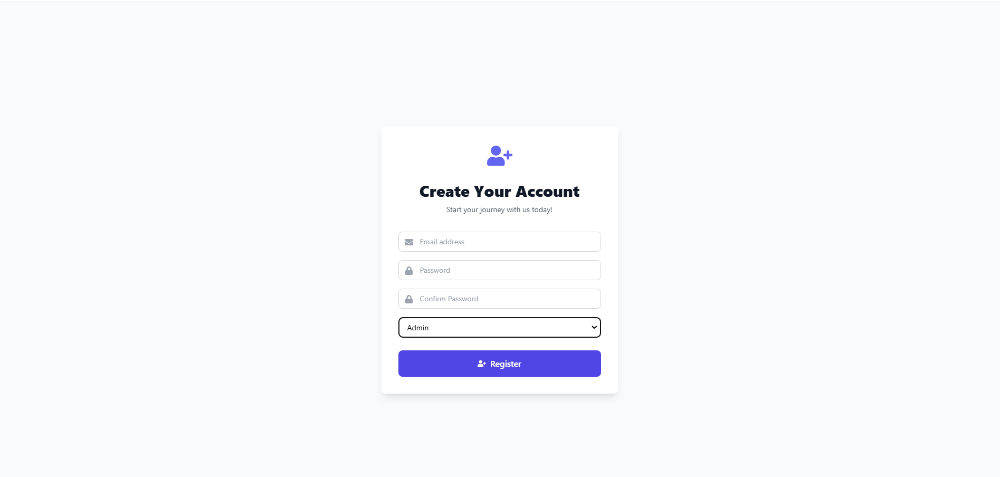
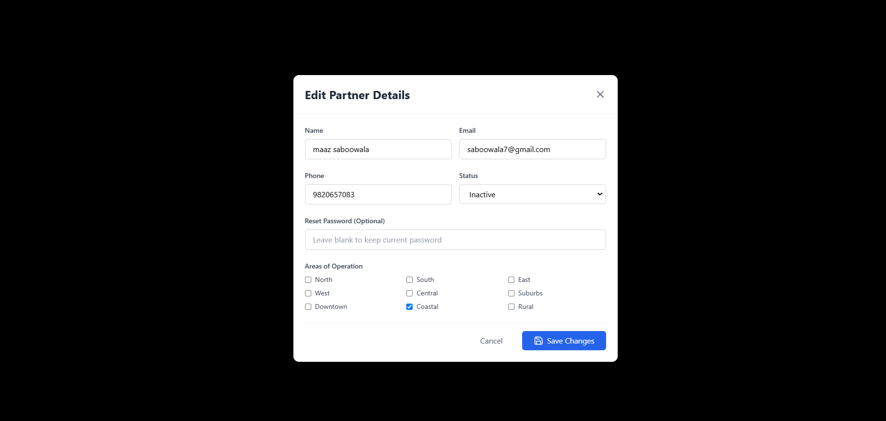
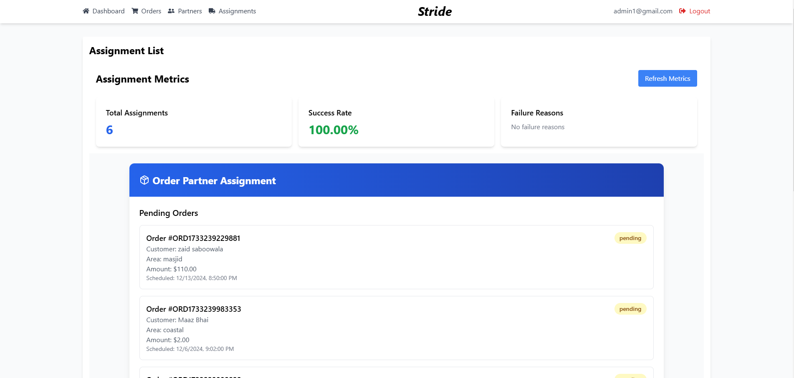

# Stride

**Stride** is a robust React + TypeScript application designed for efficient order and delivery management. It provides a seamless interface for administrators and delivery partners to handle tasks such as order creation, partner management, and status updates with ease.

---

## Features

### Admin Panel

1. **Admin Login Page**  
   - Secure login for admins to access the dashboard.  
   

2. **Dashboard**  
   - Overview of operations and statistics for efficient management.  
     
   

3. **Order Management**  
   - View all orders in a list format.  
   - Create new orders based on offline inputs with an intuitive interface.  
     
   

4. **Partner Management**  
   - Create delivery partners and view/edit their details.  
   - Toggle partner activity status (Active/Inactive).  
   - Generate login credentials for partners, shared via **Email.js**.  
     
     
   

5. **Assignment Page**  
   - Assign orders to delivery partners based on location and active status.  
   
   -Partner Assignment
   

---

### Delivery Partner Panel

1. **Partner Login Page**  
   - Delivery partners can securely log in using credentials sent via email.  
   

2. **Dashboard**  
   - View assigned orders.  
   - Update the status of orders from "Pickup" to "Delivered".  
   

---

### Common Pages

1. **Signup Page**  
   - Register as an Admin or Delivery Partner.  
   

2. **Register Admin Page**  
   - A dedicated page for creating a new admin account.  
   

---

## Technology Stack

### Frontend
- **React** with **TypeScript** for building scalable and maintainable components.  
- **Tailwind CSS** for a responsive and aesthetic UI.

### Backend
- Backend operations powered by a Node.js or Express.js server.

### Email Notifications
- **Email.js** for sending partner credentials upon account creation.

---

## Functional Workflow

### For Admin
1. **Login** → Access Dashboard → View/Create Orders → Manage Partners → Assign Orders.

### For Partner
1. **Login** → Access Dashboard → View Assigned Orders → Update Order Status.
